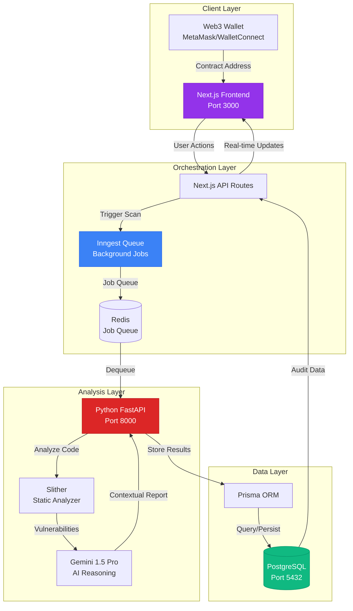
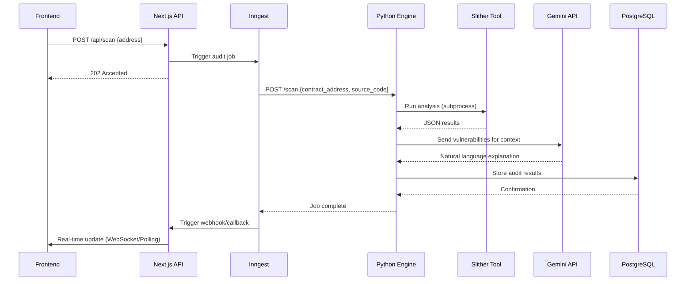
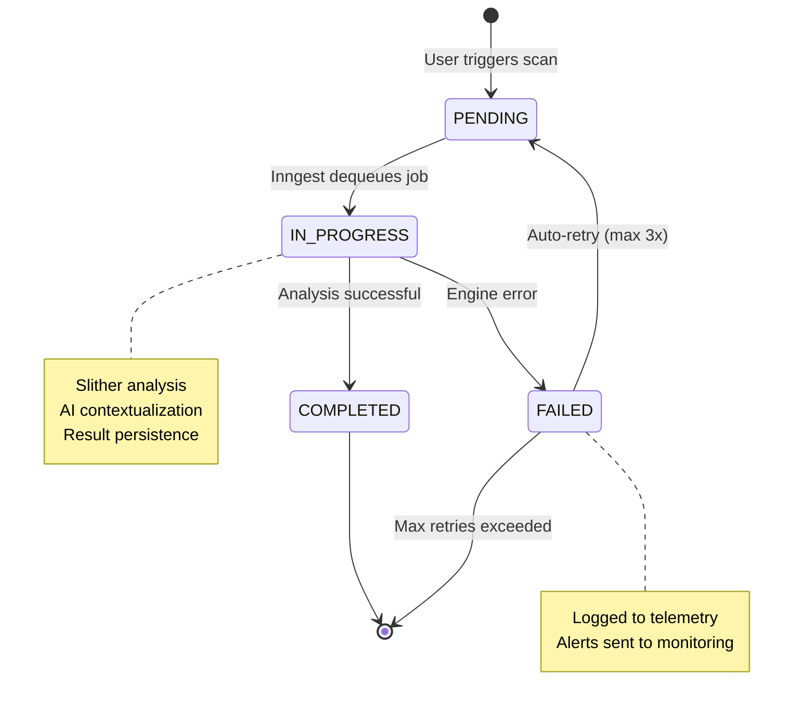
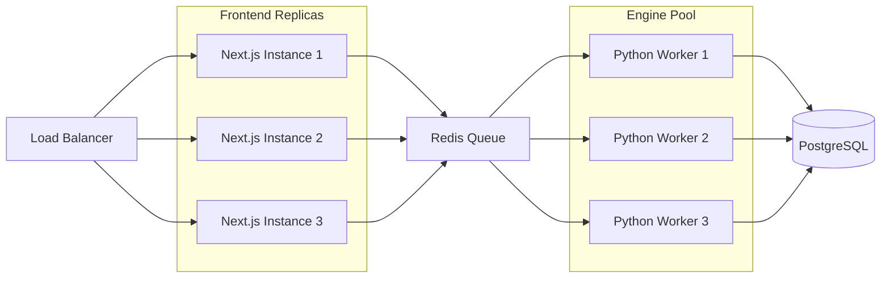

# MamoruAI System Architecture

> **Technical Deep-Dive: Zero-G Security Engineering**

This document provides a comprehensive architectural overview of MamoruAI, explaining the design decisions, component interactions, and engineering principles that make this system production-ready for Web3 security analysis.

---

## Table of Contents

1. [High-Level Architecture](#high-level-architecture)
2. [Component Breakdown](#component-breakdown)
3. [Data Flow & State Machines](#data-flow--state-machines)
4. [Security Architecture](#security-architecture)
5. [Scalability & Resilience](#scalability--resilience)
6. [Internationalization Strategy](#internationalization-strategy)

---

## High-Level Architecture

MamoruAI follows a **decoupled microservices architecture** with clear separation between the presentation layer (Next.js), orchestration layer (Inngest), and analysis engine (Python/FastAPI).



### Why This Architecture?

| Design Decision | Rationale |
|----------------|-----------|
| **Decoupled Frontend/Backend** | Frontend can iterate UI/UX independently; engine can scale horizontally |
| **Background Job Processing** | Long-running security scans don't block the UI; retry logic for reliability |
| **PostgreSQL over NoSQL** | Structured audit data with relationships (Contract → Audit → Vulnerabilities) |
| **Python for Analysis** | Slither is Python-native; ML/AI libraries have best Python support |
| **TypeScript Frontend** | Type safety prevents runtime errors in critical security UI |

---

## Component Breakdown

### 1. Frontend (Next.js 15 + TypeScript)

**Key Files:**
- [`src/app/dashboard/page.tsx`](file:///C:/Users/suraj/OneDrive/Desktop/MamoruAI/frontend/src/app/dashboard/page.tsx) - Command center UI
- [`src/lib/prisma.ts`](file:///C:/Users/suraj/OneDrive/Desktop/MamoruAI/frontend/src/lib/prisma.ts) - Database client singleton
- [`src/app/api/inngest/route.ts`](file:///C:/Users/suraj/OneDrive/Desktop/MamoruAI/frontend/src/app/api/inngest/route.ts) - Background job server

**Technologies:**
- **Next.js 15** with App Router (React Server Components)
- **TailwindCSS** for utility-first styling
- **Prisma** for type-safe database access
- **next-intl** for bilingual support (EN/JA)
- **Lucide Icons** for consistent iconography

**Design Pattern:**
```typescript
// Client Component for interactivity
"use client"
import { useState } from "react"

export default function DashboardPage() {
    const [address, setAddress] = useState("")
    
    const handleScan = async () => {
        // Trigger API route → Inngest → Engine
        await fetch('/api/scan', {
            method: 'POST',
            body: JSON.stringify({ address })
        })
    }
    
    return <UI />
}
```

---

### 2. Analysis Engine (Python FastAPI)

**Key Files:**
- [`engine/main.py`](file:///C:/Users/suraj/OneDrive/Desktop/MamoruAI/engine/main.py) - FastAPI server
- [`engine/ai_service.py`](file:///C:/Users/suraj/OneDrive/Desktop/MamoruAI/engine/ai_service.py) - Gemini integration

**Architecture:**


**Error Handling:**
```python
# Resilient subprocess execution
try:
    result = subprocess.run(
        ["slither", contract_path, "--json", "-"],
        capture_output=True,
        timeout=60  # Prevent infinite hangs
    )
except subprocess.TimeoutExpired:
    logger.error("Slither timeout - contract too complex")
    return {"error": "Analysis timeout", "retry": True}
```

---

### 3. Database Schema (PostgreSQL + Prisma)

**Schema Overview:**
```prisma
model Contract {
  id        String   @id @default(cuid())
  address   String   @unique
  audits    Audit[]
  createdAt DateTime @default(now())
}

model Audit {
  id               String                  @id @default(cuid())
  contractId       String
  contract         Contract                @relation(fields: [contractId], references: [id])
  status           AuditStatus             @default(PENDING)
  score            Int?                    // 0-100
  vulnerabilities  ScannedVulnerability[]
}

model ScannedVulnerability {
  id          String   @id @default(cuid())
  auditId     String
  type        String   // "Reentrancy", "Access Control"
  severity    Severity // CRITICAL, HIGH, MEDIUM, LOW
  description String   @db.Text
}

enum AuditStatus {
  PENDING | IN_PROGRESS | COMPLETED | FAILED
}
```

**Why This Schema?**
- **Normalization**: Prevents data duplication (one contract, multiple audits)
- **Audit Trail**: Complete history of all scans for a contract
- **Type Safety**: Prisma generates TypeScript types automatically

---

## Data Flow & State Machines

### Audit Lifecycle FSM



**State Transitions:**
```typescript
// Prisma query to transition states
await prisma.audit.update({
    where: { id: auditId },
    data: {
        status: 'IN_PROGRESS',
        updatedAt: new Date()
    }
})
```

---

## Security Architecture

### 1. Input Validation

**Contract Address Sanitization:**
```typescript
function isValidAddress(addr: string): boolean {
    // Ethereum address: 0x + 40 hex chars
    return /^0x[a-fA-F0-9]{40}$/.test(addr)
}
```

### 2. Engine Isolation

**Docker Container Security:**
```dockerfile
# Minimal attack surface
FROM python:3.11-slim

# Non-root user
RUN useradd -m -u 1000 scanner
USER scanner

# Read-only filesystem (except /tmp)
VOLUME /tmp
```

### 3. API Rate Limiting

**Prevent Abuse:**
```typescript
// middleware.ts
import { Ratelimit } from "@upstash/ratelimit"

const ratelimit = new Ratelimit({
    redis: Redis.fromEnv(),
    limiter: Ratelimit.slidingWindow(10, "10 s")
})
```

---

## Scalability & Resilience

### Horizontal Scaling



### Resilience Patterns

| Pattern | Implementation |
|---------|----------------|
| **Retry Logic** | Inngest automatic retries with exponential backoff |
| **Circuit Breaker** | If Gemini API fails 5x, switch to fallback LLM |
| **Health Checks** | `/health` endpoint on both frontend and engine |
| **Graceful Degradation** | If AI fails, return Slither results without context |

---

## Internationalization Strategy

### The "Zero-G Multilingual" Approach

**Why Bilingual Matters:**
- Japanese Web3 community = 30%+ of global DeFi TVL
- Security audits require precision—machine translation isn't enough
- Cultural trust: Japanese firms prefer native-language reports

**Implementation:**
```typescript
// messages/en.json
{
  "scan.reentrancy.title": "Reentrancy Vulnerability Detected",
  "scan.reentrancy.desc": "External call before state update allows recursive exploitation"
}

// messages/ja.json
{
  "scan.reentrancy.title": "リエントランシー脆弱性を検出",
  "scan.reentrancy.desc": "状態更新前の外部呼び出しにより再帰的攻撃が可能"
}
```

**AI-Powered Report Translation:**
```python
# ai_service.py
def generate_report(vulnerabilities, locale="en"):
    prompt = f"Explain these vulnerabilities in {locale}:\n{vulnerabilities}"
    response = gemini.generate_content(prompt)
    return response.text
```

---

## Observability & Monitoring

### Structured Logging

```python
import logging
import json

logger = logging.getLogger("mamoruai")

def log_audit(audit_id, status, metadata):
    logger.info(json.dumps({
        "timestamp": datetime.utcnow().isoformat(),
        "audit_id": audit_id,
        "status": status,
        "metadata": metadata
    }))
```

**Log Aggregation:**
- Export to **ELK Stack** (Elasticsearch, Logstash, Kibana)
- Or **Datadog** for real-time dashboards

### Metrics to Track

- **Scan Success Rate**: `COMPLETED / (COMPLETED + FAILED)`
- **Average Scan Duration**: Time from `PENDING` → `COMPLETED`
- **Vulnerability Distribution**: Count by severity (CRITICAL, HIGH, etc.)
- **AI API Latency**: Time for Gemini to respond

---

## Deployment Architecture

### Production Docker Compose

```yaml
services:
  # Load balancer (optional)
  nginx:
    image: nginx:alpine
    ports:
      - "80:80"
      - "443:443"
    volumes:
      - ./nginx.conf:/etc/nginx/nginx.conf
  
  # Database with persistent storage
  db:
    image: postgres:15-alpine
    volumes:
      - postgres_data:/var/lib/postgresql/data
    environment:
      - POSTGRES_PASSWORD=${DB_PASSWORD}
  
  # Redis for job queue
  queue:
    image: redis:7-alpine
    command: redis-server --appendonly yes
    volumes:
      - redis_data:/data
  
  # Analysis engine (scalable)
  engine:
    build: ./engine
    deploy:
      replicas: 3  # Horizontal scaling
    environment:
      - GEMINI_API_KEY=${GEMINI_API_KEY}
  
  # Frontend (stateless)
  frontend:
    build: ./frontend
    deploy:
      replicas: 2
    environment:
      - DATABASE_URL=${DATABASE_URL}
```

---

## Future Architectural Enhancements

### 1. Real-Time WebSocket Updates

Replace polling with WebSocket connections for instant audit status updates:

```typescript
// Server (Next.js API Route)
import { Server } from "socket.io"

const io = new Server(server)

io.on("connection", (socket) => {
    socket.on("subscribe", (auditId) => {
        socket.join(`audit:${auditId}`)
    })
})

// Emit from engine when audit completes
io.to(`audit:${auditId}`).emit("audit:complete", results)
```

### 2. Multi-Chain Support

Extend beyond Ethereum to support:
- **Base** (Coinbase L2)
- **Arbitrum** (Optimistic Rollup)
- **Optimism** (Optimistic Rollup)
- **Polygon** (Sidechain)

**Implementation:**
```typescript
enum Chain {
  ETHEREUM = 1,
  BASE = 8453,
  ARBITRUM = 42161,
  OPTIMISM = 10
}

// Fetch source code based on chain
async function getSourceCode(address: string, chain: Chain) {
    const explorers = {
        [Chain.ETHEREUM]: "https://api.etherscan.io",
        [Chain.BASE]: "https://api.basescan.org",
        // ...
    }
    return fetch(`${explorers[chain]}/api?module=contract&action=getsourcecode&address=${address}`)
}
```

### 3. Formal Verification Integration

Add support for mathematical proofs via:
- **Certora Prover** (formal verification as a service)
- **SMTChecker** (built into Solidity compiler)

```python
# engine/formal_verification.py
def run_certora(contract_path: str):
    result = subprocess.run(
        ["certoraRun", contract_path, "--verify", "MyContract:spec.spec"],
        capture_output=True
    )
    return parse_certora_output(result.stdout)
```

---

## Conclusion

MamoruAI's architecture is designed for **Zero-G resilience**:

- **Decoupled components** allow independent scaling
- **Background job processing** ensures reliability
- **AI-driven contextualization** separates it from traditional scanners
- **Bilingual support** targets the global Web3 market
- **Observability** enables production-grade monitoring

This is not just a security scanner—it's a **life-support system** for smart contracts floating in the permissionless vacuum of Web3.

---

**Built for the void. Engineered for trust. 🚀**
